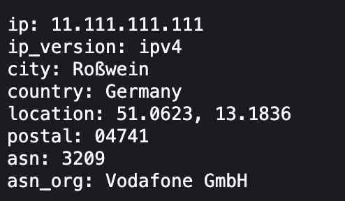

# ip-geo

A simple http-server which displays information about the current connection:

## Setup

Enter your MaxMind account id and license key in the secrets files (remove `.example` extension).

## Functionality

Utilizes MaxMinds Free GeoLite2-City and GeoLite2-ASN databases to display more information
about the connection.
